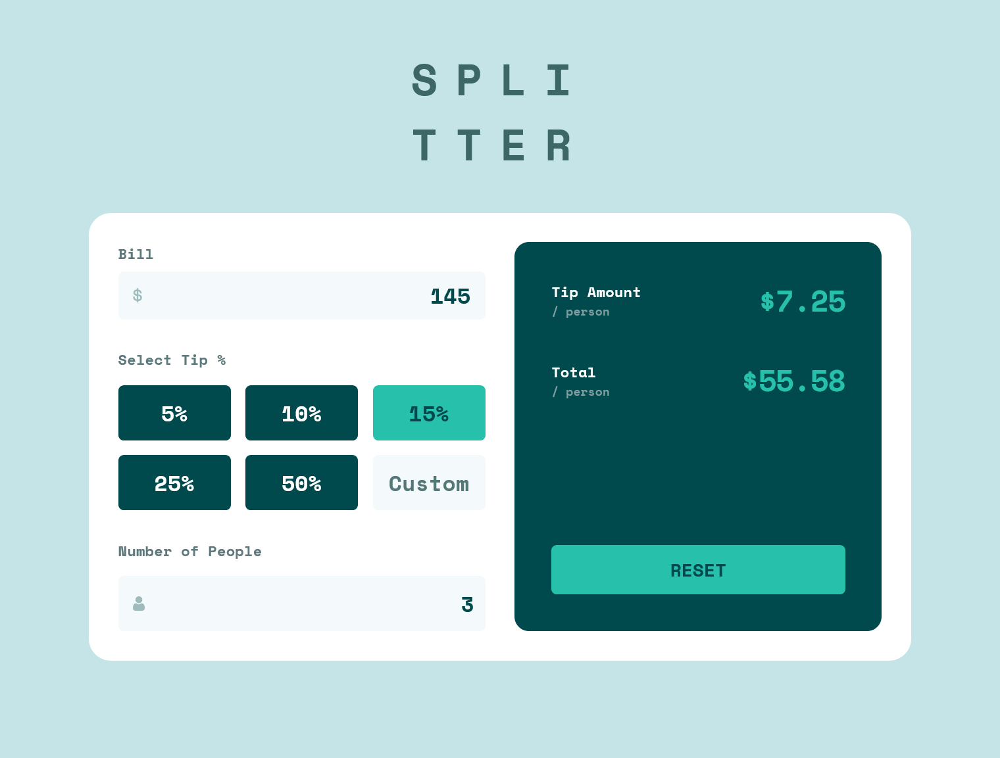

# Frontend Mentor - Tip calculator app solution

This is a solution to the [Tip calculator app challenge on Frontend Mentor](https://www.frontendmentor.io/challenges/tip-calculator-app-ugJNGbJUX). Frontend Mentor challenges help you improve your coding skills by building realistic projects.

## Table of contents

- [Overview](#overview)
  - [The challenge](#the-challenge)
  - [Screenshot](#screenshot)
  - [Links](#links)
- [My process](#my-process)
  - [Built with](#built-with)
  - [What I learned](#what-i-learned)
  - [Continued development](#continued-development)
  - [AI Collaboration](#ai-collaboration)
- [Author](#author)


## Overview

### The challenge

Users should be able to:

- View the optimal layout for the app depending on their device's screen size
- See hover states for all interactive elements on the page
- Calculate the correct tip and total cost of the bill per person
- See error messages when inputs are invalid (like "0" for people)

### Screenshot




### Links

- Solution URL: [Add solution URL here](https://your-solution-url.com)
- Live Site URL: [Add live site URL here](https://your-live-site-url.com)

## My process

### Built with

- **React (Vite)** - Learning how to handle state and components.
- **Tailwind CSS v4** - Using the new @theme and @utility features.
- **Vitest & React Testing Library** - My first time writing automated tests
- **Mobile-first workflow**

### What I learned

This project was a big step for me because I moved away from "just making it work" to thinking about how the code is organized.
**1. Breaking things down into Components**
At first, I had everything in one big App.jsx file. I learned that it’s much easier to manage if I split it into smaller pieces like BillInput, TipSelector, and ResultCard. It made my main file much cleaner.
**2. Moving logic out of React**
I learned that I don't have to keep my math formulas inside the React components. I moved them to a separate calculations.js file. This was a "lightbulb moment" because it allowed me to test the math independently from the UI.
**3. Accessibility (A11y)**
I didn't just want it to look good; I wanted it to be usable for everyone. I learned how to use aria-describedby and aria-invalid. Now, if there is a "Can't be zero" error, a screen reader will actually tell the user about it.
**4. My first automated tests**
Writing tests was the hardest but most rewarding part. I used Vitest to check my math and the React Testing Library to simulate a user clicking buttons. Seeing the "Green" status in my terminal gave me a lot of confidence that my app actually works.

```
/* Example of a test I wrote to check the math*/
test('calculates correct tip per person', () => {
  const result = calculateTip(100, 15, 2);
  expect(result).toBe(7.50);
});
```

### Continued development

- Testing: I want to get more comfortable with testing complex UI interactions.
- Tailwind v4: I want to dive deeper into the new CSS-variable-based configuration.
- React State: I'm still learning the best ways to handle more complex states, especially with "Custom" inputs and button selections.


### AI Collaboration

I worked with an AI Assistant to improve my development process.

- A11y Guidance: The AI explained how to create an "invisible bridge" between error messages and input fields using ARIA attributes.
- Testing Setup: I was guided through the installation and configuration of Vitest, which was a new tool for me.
- Code Review: The AI helped me review my component structure
## Author

- Frontend Mentor - [@yourusername](https://www.frontendmentor.io/profile/stefanteichert)


